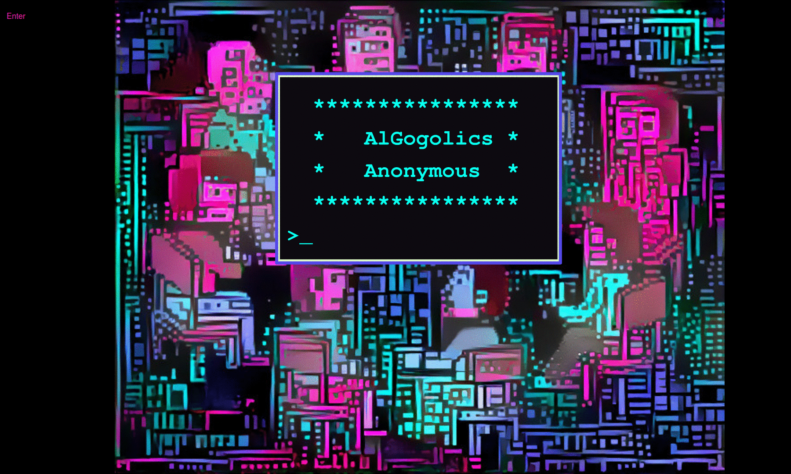

# AlGogolics Anonymous

It's a fun and nerdy game for an IT party.
Players compete in guessing famous algorithms written in various programming languages.

## :game_die: How to play

- Someone has to prepare puzzles and host a game.
- You can play in teams or individually.
- The game consists of several rounds.
During a round, all players guess the same algorithm.
The big yellow number represents the current round (starting with 0, of course).
  - At the beginning of the round all non-space symbols in the code are *censored* (replaced with `*`).
  - Each player in turn chooses a single line to open and then makes a guess.
  - If the guess is right, the player gets a point and the game continues to the next round.
  - Otherwise, the turn to play passes to the next player.
  - In the first round player #1 makes the first turn, in the second round player #2 makes the first turn, etc.
  

  
## :star2: How to host a game

### :pencil: Prepare puzzles
1. Choose a bunch of short well-known algorithms.
2. Prepare their implementations in various programming languages as separate files. Don't afraid to be creative and ingenious.
3. Fill `puzzles.json` file with information about prepared puzzles: paths to files, answers, used languages.

### :tada: Host a game
1. Click at the line number to open the line.
2. Click at the `Show answer` button when someone has solved the puzzle (or everyone gave up).
3. Click the `Next puzzle` button to move to the next round.
4. Have fun!
